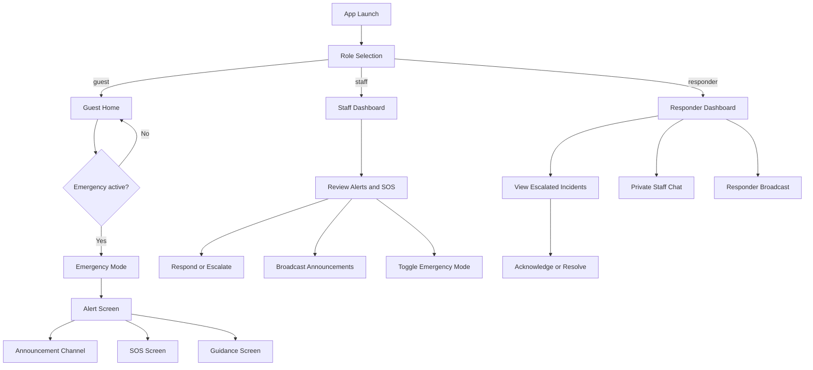
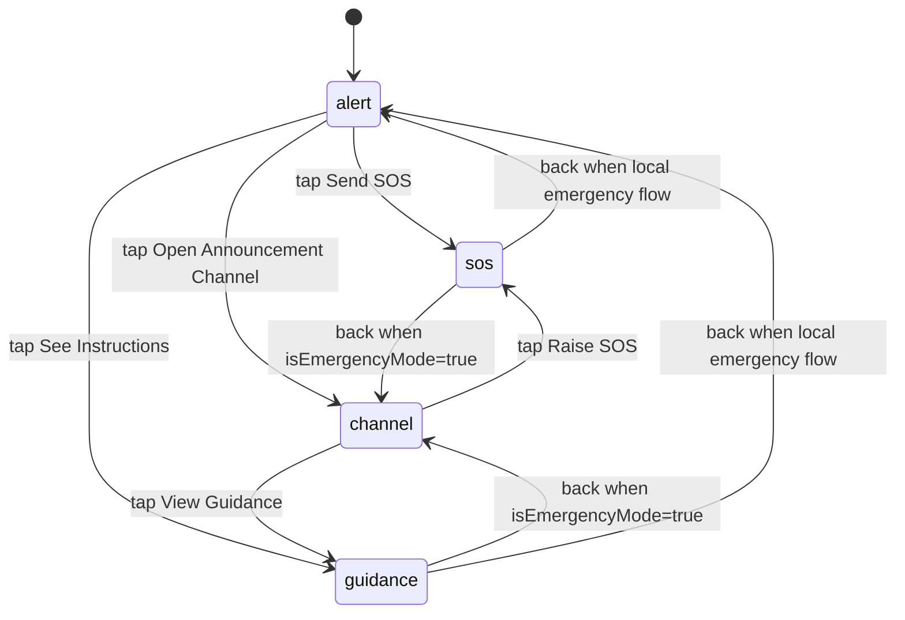

# CrisisSync App Flow

This document visualizes the high-level user journey and state-driven routing of the CrisisSync application.

## High-Level User Journey

## Emergency Sub-Screen Navigation (Guest)

