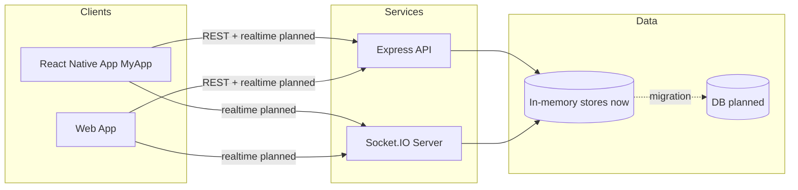
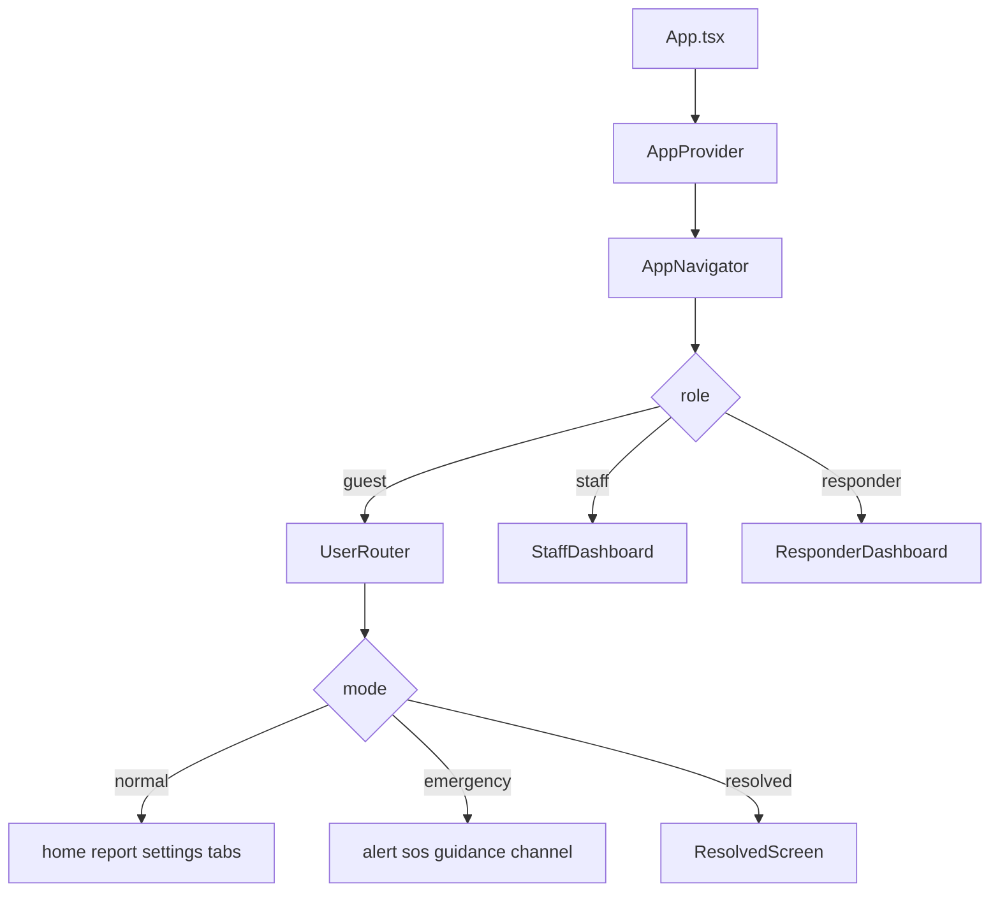

# Architecture Overview

## Purpose

This document describes the current architecture of the emergency solution and the mobile app internals.

## Solution Topology

The repository currently contains:

- MyApp: React Native client (primary app for guest, staff, responder)
- backend: Node.js + Express + Socket.IO service
- web: Vite React web client

## Mobile App Architecture (MyApp)

The React Native app uses a context + reducer pattern as the app state core.

### Layers

1. Presentation layer
   - Role screens and shared UI components.
2. Navigation layer
   - Role router and user emergency sub-screen routing.
3. State layer
   - AppContext reducer, domain actions, mock simulation handlers.
4. Integration layer (current and planned)
   - Current: mock functions in AppContext.
   - Planned: backend API + Socket.IO wiring.

### Core Runtime Path

## State Model

The global state includes:

- app lifecycle
  - mode, activeEmergency, emergencySubScreen
- session and identity
  - guestSession, role
- safety context
  - guestStatus, distressSignals, sosActive, location state
- communication domain
  - incomingAlerts, sosRequests, broadcastMessages, privateMessages
  - escalatedAlerts
  - isEmergencyMode
  - userLastSeenBroadcastAt

### Important Design Choice

State updates for critical guest actions (for example SOS) happen locally first for immediate feedback, then can be synchronized with backend events later.

## Navigation and Interaction Model

### Role Routing

- role = null -> RoleSelectionScreen
- role = staff -> StaffDashboardScreen
- role = responder -> ResponderDashboardScreen
- role = guest -> UserRouter

### Guest Emergency Routing

- emergencySubScreen supports:
  - alert
  - sos
  - guidance
  - channel

### Back Press Strategy

Android hardware back is handled centrally to avoid accidental exits during emergency mode.

## Domain Capabilities by Role

### Guest

- receives emergency context and announcements
- raises SOS
- views guidance
- tracks SOS status timeline

### Staff

- triages incoming alerts and SOS
- acknowledges/resolves/escalates incidents
- activates and deactivates emergency mode
- broadcasts public announcements
- private chat with responder

### Responder

- handles escalated incidents only
- updates incident status
- broadcasts updates
- private chat with staff

## Data Contracts

Communication contracts are defined in typed models.

### Primary Entities

- Alert
- SOSRequest
- BroadcastMessage
- PrivateMessage

### Event Categories

- user to staff (SOS, reports)
- staff actions (respond, escalate, emergency, announce)
- responder actions (update incident, announce, private message)
- server push events (new alert, updates, broadcasts, emergency activation/deactivation)

## Backend Architecture Snapshot

Backend service currently provides:

- Express routes for users, alerts, messages
- Socket.IO realtime server
- in-memory stores for alerts, SOS, and messages

This is suitable for local simulation and fast UI iteration, but not production durability.

## Non-Functional Considerations

### Reliability

- Current in-memory backend loses state on restart.
- Planned move to persistent storage is required.

### Performance

- Mobile rendering relies on local state and simple lists.
- Feed size limits and pagination should be added for scale.

### Security

- Role selection is currently UI-level only.
- Authentication and role authorization are planned.

### Accessibility and Localization

- i18n resources are present across multiple languages.
- UI should continue to avoid hardcoded strings as flows expand.

## Recommended Evolution Path

1. Introduce service adapters in mobile app for API and socket calls.
2. Keep reducer as source of truth for rendered state.
3. Add event normalization layer for server payloads.
4. Persist backend entities in database.
5. Add auth and role-based access controls.
6. Add E2E tests for three-role emergency scenarios.

## Key Files for Reference

- src/context/AppContext.tsx
- src/navigation/AppNavigator.tsx
- src/hooks/useHardwareBackPress.ts
- src/screens/user/\*
- src/screens/staff/StaffDashboardScreen.tsx
- src/screens/responder/ResponderDashboardScreen.tsx
- src/types/communication.ts
