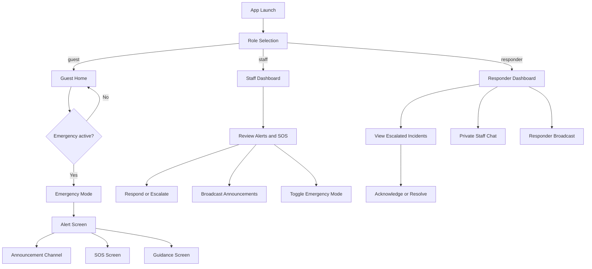
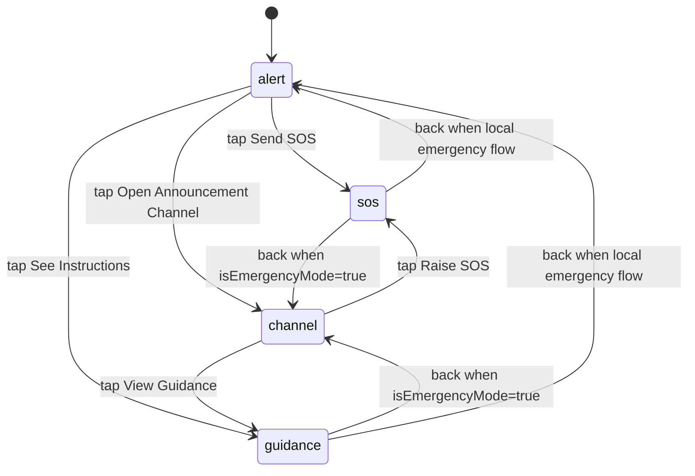

# Emergency App Flow

## Purpose

This document defines the end-to-end behavior of the React Native emergency app for three roles:

- guest (user-facing)
- staff
- responder

It reflects the current mock-first implementation in the mobile app state layer.

## Actors and Responsibilities

- Guest
  - Receives emergency alerts and announcements.
  - Can raise SOS and report issues.
  - Tracks SOS response progress.
- Staff
  - Monitors incoming alerts and SOS requests.
  - Acknowledges, resolves, or escalates incidents.
  - Activates/deactivates emergency mode.
  - Broadcasts announcements.
- Responder
  - Handles escalated incidents.
  - Updates incident status.
  - Communicates with staff and broadcasts updates.

## High-Level User Journey

## State-Driven Flow Model

The app behavior is primarily controlled by:

- mode: normal | emergency | resolved
- role: guest | staff | responder | null
- emergencySubScreen: alert | sos | guidance | channel
- isEmergencyMode: staff-controlled global emergency flag

### Emergency Sub-Screen Navigation (Guest)

## Detailed Role Flows

### 1) App Entry and Role Routing

1. App opens with Role Selection.
2. User chooses guest, staff, or responder.
3. Router loads role dashboard.
4. Guest sees tabbed navigation (home, report, settings) while in normal mode.

### 2) Staff Triggers Emergency Mode

1. Staff taps Activate Emergency.
2. Global emergency flag is enabled.
3. Emergency event is created with severity, message, and instructions.
4. Guest side enters emergency mode and can be routed to the announcement channel.
5. Staff and responder dashboards show emergency banners.

### 3) Guest Emergency Interaction

1. Guest sees emergency alert details (type, severity, issued time).
2. Guest can:
   - send SOS
   - view guidance
   - open announcement channel
   - mark as safe
3. Announcement channel shows:
   - system emergency alert
   - live broadcast feed
   - compact guidance panel
   - SOS timeline panel

### 4) SOS Submission and Tracking

1. Guest opens SOS screen.
2. App attempts location permission and location fetch.
3. Guest sends SOS.
4. Local SOS state updates immediately (mock-first behavior).
5. Staff receives SOS request and can move status through:
   - active
   - acknowledged
   - responding
   - resolved
6. Guest sees status progression on the SOS timeline card.

### 5) Staff Incident Triage

1. Staff reviews incoming alerts and SOS list.
2. Staff actions:
   - acknowledge/respond
   - resolve
   - escalate to responder
3. Escalated alerts become visible to responder dashboard.

### 6) Responder Operations

1. Responder views escalated incidents.
2. Responder acknowledges or resolves incidents.
3. Responder can:
   - send public announcements
   - send private messages to staff

### 7) Announcement Read Tracking

1. Guest unread announcement count is derived from broadcast timestamps.
2. Opening announcement channel marks announcements as seen.
3. Alert screen and channel header display unread indicators.

## Back Button Behavior (Android)

- Emergency mode blocks accidental app exit.
- From guest SOS/guidance:
  - if global emergency mode is active, back returns to announcement channel
  - otherwise, back returns to alert or normal mode depending on source
- In resolved mode, back returns to normal mode.

## Operational Scenarios

### Scenario A: Full Emergency Cycle

1. Staff activates emergency.
2. Guest receives alert and opens announcement channel.
3. Guest sends SOS.
4. Staff acknowledges SOS and escalates related alert.
5. Responder resolves incident.
6. Staff deactivates emergency.
7. Guest returns to normal mode.

### Scenario B: Guest-Initiated SOS Without Global Emergency

1. Guest taps Emergency SOS from home.
2. App enters emergency mode with SOS sub-screen.
3. Guest sends SOS and waits for updates.
4. Back behavior returns guest safely to normal flow when appropriate.

## Current Scope and Future Flow Extensions

Current implementation is mock-first in mobile state and simulation handlers.
Planned extension points:

- replace mock handlers with socket and API integration
- persist alerts/SOS/messages in backend store
- enforce role auth and permission policies
- add notification delivery for backgrounded clients
